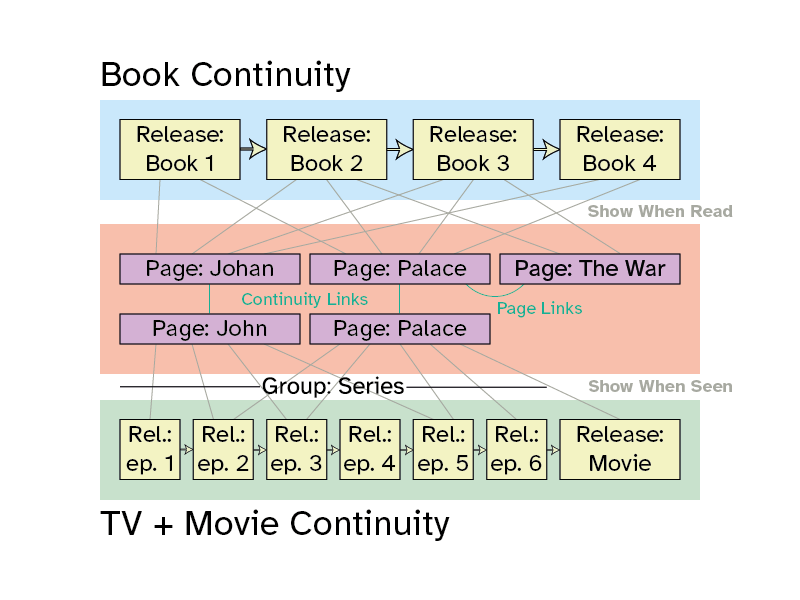

<div align="center">


# Story Wiki

**Spoiler Free Wiki Software**

[](https://discord.gg/wNpPRkqBzw)

</div>

# WIP EVERYTHING BEYOND THIS POINT NEEDS REWRITING

StoryWiki is a web frontend for displaying wiki style content optimised for
stories. It makes a number of changes to the normal structure of wikis in order
to provide an optimised experience specifically for wikis about serialised
narratives.

## Features



Two core features exist in story wikis that do not exist in their more
traditional knowledge base counterparts, both are optional:

### Releases

Releases allow you to specify distinct units of content that a user can mark as
'observed' in order to reveal content. This allows users to browse the wiki
without seeing content that would spoil releases they have not yet observed.

Releases must be part of a monotonically increasing sequence, where observing
one implies you have observed everything that comes before it.

You are also able to group releases, this is purely visual and is useful for
showing seasons in a TV series, or narrative arcs in a larger story.

### Continuities

Continuities allow you to have multiple competing versions of the narrative,
such as the original books, and the TV series adaptation of them.

These can contain crosslinks, making it easy to navigate between the two. Each
continuity has its own seperate set of releases that must be defined.

This is useful as it allows you to share content such as images, and snippets
of text that are true for multiple continuities.

### Markdown

Pages are written in an extended commonmark based syntax, making them much
easier to build and write than many traditional wiki syntaxes.

```md
<article>

# Albus Dumbledore

Dumbledore <x-6>is</x-6><o-6>was</o-6> the head master of [Hogwarts][hogwarts].
Noted for treating every single house and student entirely equally, with no
favourites at all.

Here are some of his<o-6> former</o-6> colleagues

 * [Severus Snape][snape]
 * [Gilderoy Lockhart][lockheart]
 * [Minevra McGonagall][mcgonagall]

</article>
<aside>


</aside>
```


## Usage

To use the page, go to releases and download the latest version, put this in a 
directory and serve it, with any error 404 not found showing the
`dist/index.html` file instead of the servers basic error.

Then, your website is driven by `manifest.md`, and the pages you may place
anywhere, and link to from inside the manifest (recommended is
`/content/continuity/page/page.md`).

### Manifest Format

```toml
title = "My Wiki Title"
search_index = "/path/to/search.swsi"

[[continuities]]
display_name = "Book Series"
reference_name = "books"

[[releases.books]]
display_name = "Book 1"
reference_name = "b1"
begins_group = "Original Trilogy"

[[releases.books]]
display_name = "Book 2"
reference_name = "b2"

[[pages.books]]
display_name = "Steven Smith"
page_name = "steven"
title_peers = ["mr smith", "steven smith"]
conditional = "o-b2"
```

The above shows an example with formatting notes.

  * `title` will be set as the webpage title.
  * `search_index` is optional, and if used will enable searching (see below).
  * `continuities` must be specified, have multiple of this section for each
    one.
    * `display_name` is the display name that will be shown in the UI.
    * `reference_name` is the name used to refer to the continuity in future 
       core, it must consist of characters `A-Za-z0-9_-`.
  * `releases` must specify the continuity as `releases.{reference_name}`,
     by default releases will be treated as following in order, each implying
     the previous one.
    * `display_name` is the display name that will be shown in the title and in
      the continuity selector.
    * `reference_name` is the name that will be used conditional codes, it must
      consist of characters `A-Za-z0-9_-`.
    * `begins_group` optionally contains the name of a group heading that should
      be placed visually before this element, and will continue until the next
      group is begun. If you wish to end a group without beginning a new one,
      you may set `begins_group = ""`.
  * `pages` must specify the continuity as `pages.{reference_name}`.
    * `display_name` is the display name that will be shown in the title
    * `page_name` is the name that will be used in code and in the URL, it must
      consist of charactse [`A-Za-z0-9_-`].
    * `page_name_peers` is an optional list of titles that should redirect to
      this page, these are used in searching if enabled and in the URL, and
      should contain the characters [`a-z0-9 `]. conditional redirects are 
      possible also (see below). The display name is automatically counted as a
      page name peer.
    * `conditional` is an optional condition specifier (see below).

### Enabling Search

If you wish to enable searching, you must provide a search index file, this is a
file statically computed based on the content of your website. You can create
this file by running a binary available in this package.

```
$ cargo install story-wiki-cli
$ story-wiki-cli search-index ./path/to/manifest.md
```

### Condition Specifiers

Condition specifiers are short tags that can be used to indicate that content
should only be shown if a user has consumed a particular release. In general
terms, a person has either "Observed" or "Excluded" a release, these give the
tag prefixes `o-` and `x-`. If you use the `o-` prefix, then the content will
only be shown to someone who has consumed the release. If you use the `x-`
prefix, then the content will only be shown to someone who has **not** consumed
the release.

For example, if you have a tag `b2` as above, then `x-b2` would mark content
that should be seen by anyone who **has not yet** read book 2, and `o-b2` would
mark content that should only be shown to people who **have** read book 2.

### Conditional Redirects

While not specified in the manifest, it is possible to perform a redirect if a
person loads a specific page after having consumed a certain release, or before.

This can be done by placing a the following content at the top of the page.

```md
<div
  data-redirect
  data-redirect-condition="specifier"
  data-redirect-target="target_page_name"
></div>
```

It is not possible to set a conditional title or name, and thus this must be
done through conditional redirects. For example you could not have the page for
`scabbers` become `peter_pettigrew` after a person marks harry potter book 3 as
read, so you must specify:

```md
<!-- in `scabbers.md` -->
<div
  data-redirect
  data-redirect-condition="o-b3"
  data-redirect-target="peter_pettigrew"
></div>
```

Note this will not automatically perform the reverse operation, so if a person
was on the peter pettigrew page, and changed book 3 to excluded, they would
end up either on a 404 page, or on the search page for peter pettigrew (if a
search index is configured). If you wanted to enable the reverse, you could set

```md
<!-- in `peter_pettigrew.md` -->
<div
  data-redirect
  data-redirect-condition="x-b3"
  data-redirect-target="scabbers"
></div>
```